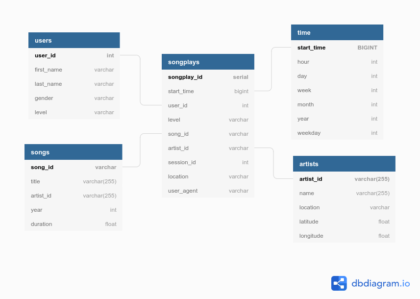

# Udacity Data Engineering Nanodegree
## Project 1: Data Modeling with Postgres

##### &nbsp;

## Introduction
A hypothetical startup called Sparkify wants to analyze the data they've been collecting on songs and user activity on their new music streaming app. Their analytics team is particularly interested in understanding what songs users are listening to. Currently, they don't have an easy way to query their data, which resides in a directory of JSON logs on user activity on the app, as well as a directory with JSON metadata on the songs in their app.

The assignment is that they'd like a data engineer to create a Postgres database with tables designed to optimize queries on song play analysis. 

The project task is to create a database schema and ETL pipeline for this analysis. To test the  database and ETL pipeline by running queries given by the analytics team from Sparkify and compare the results with their expected results.

##### &nbsp;

## Project Description
This project applies what has been learned on data modeling with Postgres course and builds an ETL pipeline using Python. The project requires completion of fact and dimension tables for a star schema for a particular analytic focus, and write an ETL pipeline that transfers data from files in two local directories into these tables in Postgres using Python and SQL.

##### &nbsp;

## Python scripts

create_tables.py: Creates tables.

sql_queries.py: All queries used in the ETL pipeline.

etl.py: Read JSON logs and JSON metadata and load the data into the generated tables.

##### &nbsp;

## Database Schema


##### &nbsp;


### Schema for Song Play Analysis
Using the song and log datasets, a star schema optimized for queries on song play analysis is created. This includes the following tables.

#### Fact Table
1. `songplays` &mdash; records in log data associated with song plays i.e. records with `page` = `NextSong`
   - *songplay_id, start_time, user_id, level, song_id, artist_id, session_id, location, user_agent*

#### Dimension Tables
2. `users` &mdash; users in the app
   - *user_id, first_name, last_name, gender, level*

3. `songs` &mdash; songs in music database
   - *song_id, title, artist_id, year, duration*

4. `artists` &mdash; artists in music database
   - *artist_id, name, location, latitude, longitude*

5. `time` &mdash; timestamps of records in songplays broken down into specific units
   - *start_time, hour, day, week, month, year, weekday*


##### &nbsp;

## Project Setup & Instructions

##### &nbsp;

### <b>Songs and Artists</b>
### Source Dataset
The first dataset is a subset of real data from the [Million Song Dataset](https://labrosa.ee.columbia.edu/millionsong/). Each file is in JSON format and contains metadata about a song and the artist of that song. The files are partitioned by the first three letters of each song's track ID. For example, here are filepaths to two files in this dataset.

```
song_data/A/B/C/TRABCEI128F424C983.json
song_data/A/A/B/TRAABJL12903CDCF1A.json
```
And below is an example of what a single song file, TRAABJL12903CDCF1A.json, looks like.

```
{
   "num_songs": 1, 
   "artist_id": "ARJIE2Y1187B994AB7", 
   "artist_latitude": null, 
   "artist_longitude": null, 
   "artist_location": "", 
   "artist_name": "Line Renaud", 
   "song_id": "SOUPIRU12A6D4FA1E1", 
   "title": "Der Kleine Dompfaff", 
   "duration": 152.92036, 
   "year": 0
}
```
### Final Tables

- songs table: song_id, title, artist_id, year, and duration

| song_id            | title                          | artist_id          | year | duration  |
|--------------------|--------------------------------|--------------------|------|-----------|
| SOBCOSW12A8C13D398 | Rumba De Barcelona             | AR7SMBG1187B9B9066 | -    | 218.38322 |
| SOFFKZS12AB017F194 | A Higher Place (Album Version) | ARBEBBY1187B9B43DB | 1994 | 236.17261 |

##### &nbsp;
- artist table: artist_id, name, location, latitude, and longitude

| artist_id          | name          | location        | lattitude | longitude |
|--------------------|---------------|-----------------|-----------|-----------|
| AR7SMBG1187B9B9066 | Los Manolos   |                 | -         | -         |
| ARBEBBY1187B9B43DB | Tom Petty     | Gainesville, FL | -         | -         |


##### &nbsp;

### <b>Log Data</b>

### Sourse Dataset
The second dataset consists of log files in JSON format generated by this [event simulator](https://github.com/Interana/eventsim) based on the songs in the dataset above. These simulate activity logs from a music streaming app based on specified configurations.
The log files in the dataset are partitioned by year and month. For example, here are filepaths to two files in this dataset.

````
log_data/2018/11/2018-11-12-events.json
log_data/2018/11/2018-11-13-events.json
````

And below is an example of what the data in a log file, 2018-11-12-events.json, looks like.


And this is the json format.
```json
{
  "artist": "Pavement",
  "auth": "Logged In",
  "firstName": "Sylvie",
  "gender": "F",
  "itemInSession": 0,
  "lastName": "Cruz",
  "length": 99.16036,
  "level": "free",
  "location": "Washington-Arlington-Alexandria, DC-VA-MD-WV",
  "method": "PUT",
  "page": "NextSong",
  "registration": 1540266185796.0,
  "sessionId": 345,
  "song": "Mercy:The Laundromat",
  "status": 200,
  "ts": 1541990258796,
  "userAgent": "\"Mozilla/5.0 (Macintosh; Intel Mac OS X 10_9_4) AppleWebKit/537.77.4 (KHTML, like Gecko) Version/7.0.5 Safari/537.77.4\"",
  "userId": "10"
}
```

Viewing the JSON data within log_data files can be done with a pandas dataframe to read the data. 

```
df = pd.read_json(filepath, lines=True)
```

For example, ```df = pd.read_json('data/log_data/2018/11/2018-11-01-events.json', lines=True) ```would read the data file ```2018-11-01-events.json```.  

For a refresher on JSON file formats, [here is a helpful video](https://www.youtube.com/watch?time_continue=1&v=hO2CayzZBoA).

##### &nbsp;

### Final Tables
##### &nbsp;
- time table: timestamp, hour, day, week of year, month, year, and weekday from the ts field.

| start_time                 | hour | day | week | month | year | weekday |
|----------------------------|------|-----|------|-------|------|---------|
| 1541903636796              | 0    | 11  | 45   | 11    | 2018 | 6       |
| 1541903770796              | 0    | 11  | 45   | 11    | 2018 | 6       |
##### &nbsp;
##### &nbsp;
- users table: user_id, first name, last name, gender and level.

| user_id | first_name | last_name | gender | level |
|---------|------------|-----------|--------|-------|
| 69      | Anabelle   | Simpson   | F      | free  |
| 32      | Lily       | Burns     | F      | free  |
##### &nbsp;
##### &nbsp;
- songplays table: timestamp, user_id, level, song_id, artist_id, session_id, location, and user_agent.

| songplay_id | start_time                 | user_id | level | song_id | artist_id | session_id | location                                    | user_agent                                                                                                              |
|-------------|----------------------------|---------|-------|---------|-----------|------------|-------------------------------------|-------------------------------------------------------------------------------------------------------------------------|
| 1           | 1541903636796              | 69      | free  | -       | -         | 455        | Philadelphia-Camden-Wilmington, PA-NJ-DE-MD | "Mozilla/5.0 (Macintosh; Intel Mac OS X 10_9_4) AppleWebKit/537.36 (KHTML, like Gecko) Chrome/36.0.1985.125 Safari/537.36" |


##### &nbsp;

### Project Template
The source data files are located in the `/data` directory.  

The files are available in the `/project_template` directory:

- `test.ipynb` displays the first few rows of each table to check the database.
- `create_tables.py` drops and creates tables. This must be run to reset the tables before each time the ETL script is run.
- `etl.ipynb` reads and processes a single file from song_data and log_data and loads the data into the tables. The notebook contains detailed instructions on the ETL process for each of the tables.
- `etl.py` reads and processes files from song_data and log_data and loads them into the tables. This is completed based the the ETL notebook code.
- `sql_queries.py` contains all the sql queries, and is imported into the last three files above.
README.md documents the project.


##### &nbsp;

## Project Steps
Below are the basic steps in completing the project:

1. **Create Tables**
   1. Write CREATE statements in sql_queries.py to create each table.
   1. Write DROP statements in sql_queries.py to drop each table if it exists.
   1. Run create_tables.py to create the database and tables.
   1. Run test.ipynb to confirm the creation of the tables with the correct columns. Click "Restart kernel" to close the connection to the database after running this notebook.
1. **Build ETL Processes**
   1. The instructions in the etl.ipynb notebook document the ETL processes for each table. At the end of each table section, or at the end of the notebook, test.ipynb can be run to confirm that records were successfully inserted into each table.
   1. create_tables.py is run to reset the tables before each time the notebook is run.
1. **Build ETL Pipeline**
   1. etl.ipynb forms the basis of etl.py, where the entire datasets are processed. creaate_tables.py is run before running etl.py to reset the tables.
   1. Run test.ipynb to confirm the records were successfully inserted into each table.

##### &nbsp;


